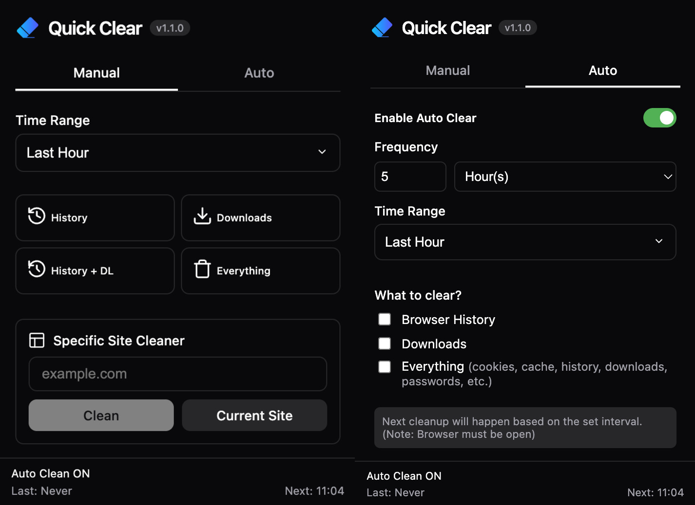

# Quick Clear - Chrome Extension

A modern, fast extension to clear browser history, downloads, and site-specific data (cookies, storage).



## Development

```bash
npm install
npm run dev   # UI development
npm run build # Build extension to dist/
npm run version 1.1.0 # Update version in package.json and manifest.json
npm run zip   # Create a .zip file for Chrome Web Store upload
npm run prettier # Format code
```

## Installation

1. If you just want to use the latest version, extract the zip file from `zip/` folder and load it in Chrome.
2. Open `chrome://extensions`
3. Enable **Developer mode**
4. Click **Load unpacked**
5. Select the `dist/` folder
